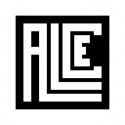

<h1 align="center">Alce Game Engine</h1>

Alce Game Engine is a feature-rich game engine based on SFML and Box2D, designed to simplify the development of 2D games. Its primary goal is to provide a comprehensive suite of tools and components that streamline the creation process—from physics simulations and animations to user interface management and local storage.

# News and Updates

### > (03/03/2025) Release: Alce Runtime Language (ARL)

A lightweight, human-readable command language designed for dynamic scene development and modification during runtime. It allows you to make real-time changes without the need for recompilation, streamlining iterative workflows in applications such as game development or interactive simulations.
 
Just write your prompts in the console while the game is running!

[ARL Documentation](Documentation/ARL/ARL.md)

# Features

* ## Components:
    * [Animation2d](Source/Alce/Engine/Components/Animation2d/): handles 2D sprite sheet animations, allowing you to define, play, and control animations with different playback modes, frame timing, and origins. It also updates cardinal positions for spatial references.

    * [Camera](Source/Alce/Engine/Components/Camera/):  defines a 2D camera that controls the visible area of the scene, supporting zoom, viewport configuration, and smooth following of its associated game object's position and rotation.

    * [ParticleSystem](Source/Alce/Engine/Components/ParticleSystem/): manages a 2D particle system that emits physics-based particles from a defined area, applying customizable behaviors, collisions, and lifetimes to simulate effects like explosions, smoke, or sparks.

    * [Raycast2d](Source/Alce/Engine/Components/Raycast2d/): performs 2D raycasting to detect collisions along a direction and length, triggering impact events when objects are hit or no longer hit.

    * [Rigidbody2d](Source/Alce/Engine/Components/Rigidbody2d/): manages the 2D physics simulation of an object using Box2D, allowing the creation of rigid bodies with different shapes, applying forces and impulses, configuring physical properties (such as friction, density, or restitution), and synchronizing their position and rotation with the engine's transform system.

    * [SpriteRenderer](Source/Alce/Engine/Components/SpriteRenderer/): renders a 2D sprite using a texture, allowing you to load, assign, and manage multiple textures, while also updating its position, scale, rotation, and cardinal points based on the associated game object's transform.

    * [Light2D](Source/Alce/Engine/Components/Light2D/): defines a 2D light source (either radial or directional) that can be positioned, colored, and configured with parameters like range, intensity, beam width, and angle, to simulate dynamic lighting effects in a 2D environment.

    * [LightMesh2D](Source/Alce/Engine/Components/LightMesh2D/):  represents a 2D shape used as a light-blocking or light-interacting mesh, allowing you to define custom geometry (rectangle, circle, or polygon) that updates with the object's transform and can be visualized in debug mode.

    * [LightingArea2D](Source/Alce/Engine/Components/LightingArea2D/): defines and manages a 2D lighting area that can render fog-like effects, adjusting its size, position offset, color, and opacity dynamically within a game or graphical application.

* ## Modules:
    * [Core](Source/Alce/Engine/Modules/Core/): manages window creation, scene management, asset loading (textures, sounds, fonts), system info retrieval, input handling, and the main game loop for a graphical application using SFML.

    * [Audio](Source/Alce/Engine/Modules/Audio/): manages audio playback by organizing sounds into channels, allowing loading, controlling (play, pause, stop), and adjusting sound properties (volume, pitch, looping) within each channel.

    * [Storage](Source/Alce/Engine/Modules/Storage): manages persistent JSON-based data storage by dynamically mapping named entries to multiple segmented files, ensuring size limits are respected and providing methods to set, get, delete, and clear stored data.

    * [Chrono](Source/Alce/Engine/Modules/Chrono/): implements a Time class that stores time internally in milliseconds and provides methods and operators to add, subtract, convert, compare, and reset time values with validation against negative inputs.

    * [Debug](Source/Alce/Engine/Modules/Debug/): provides a DEBUG utility for formatted console logging with color-coded message types (info, warning, ARL messages/errors), optional asynchronous file persistence, and rate-limiting based on elapsed time.

    * [Input](Source/Alce/Engine/Modules/Input/): handles input detection and state tracking for keyboard, mouse, and joystick devices, including button presses, button downs (edge detection), axis values, mouse position, and joystick connectivity, with an enable/disable control.

    * [Math](Source/Alce/Engine/Modules/Math/):  provides mathematical utilities, random number generation, 2D vector operations, and shape classes (rectangle, polygon, circle) with geometry-related functions and conversions.

    * [Color](Source/Alce/Engine/Modules/Color/): Wrapper class for SFML's sf::Color providing multiple constructors and setters for RGB, RGBA, hex and string formats, color blending, conversions, and predefined common colors with error handling and string parsing utilities in C++.

* ## Utils:
    * [Collections](Source/Alce/Engine/Core/Collections/): provides a collection of generic, exception-safe container classes—including a customizable List with advanced manipulation and filtering capabilities, a Pair utility, and a Dictionary implemented on top of the List—designed to facilitate flexible and efficient data storage and retrieval.

    * [String](Source/Alce/Engine/Core/String/): versatile String class wrapping SFML’s string type, offering extensive manipulation methods such as substring operations, case conversion, comment removal, parsing to various data types, trimming, splitting, regex matching, and comprehensive operator overloads for flexible and efficient string handling in C++.

    * [Json](Source/Alce/Engine/Core/Json/): JSON wrapper class for C++ using RapidJSON, providing methods to parse from strings or files, get/set JSON values (strings, nested JSON, lists), check keys, delete or clear members, validate JSON, and serialize back to formatted strings or save as files — with exception handling for type errors and missing keys.

    * [FileSystem](Source/Alce/Engine/Core/FileSystem/): File and Folder management wrapper using C++17 std::filesystem, providing methods to create, delete, read, write, append, and clear files, check existence of files and folders, and handle paths as absolute strings with exception handling for invalid operations.

* ## UIElements (User Interface):
    > ⚠️ These elements are not recommended to be used yet.
    * [Button](Source/Alce/Engine/UI/Button/)
    * [Image](Source/Alce/Engine/UI/Image/)
    * [Text](Source/Alce/Engine/UI/Text/)
    * [TextInput](Source/Alce/Engine/UI/TextInput/)

* ## CLI
  
    * [Alce CLI](Documentation/CLI/cli.md): prompt program designed to compile, generate and run Alce projects. Perfect if you dont want to install a complete C++ environment like Visual Studio or Code::Blocks.

    * [ARL](Documentation/ARL/ARL.md): the in-game development prompt language. Allows the developer to make a lot of repetitive debug stuff without the need of being compiling constantly.

# Setup

Learn how to set up Alce Engine with ease through [this tutorial](./Documentation/Tutorials/setup.md).

# Requirements

Minimun requirements:
* GCC 32bit v13.1.0^ (g++, mingw32-make, gdb)
* Windows 10, 11

Recommended:
* Python v3.1.0^

# Contact

For any professional inquiries, please contact me at gabrielbeguren@outlook.com. If you wish to contribute ideas or report any bugs, feel free to use the tools that GitHub provides.

# External Libraries used by Alce Engine

*  [SFML](https://github.com/SFML/SFML) under the [ZLIB license](https://github.com/SFML/SFML?tab=Zlib-1-ov-file#readme)
*  [Box2d](https://github.com/erincatto/box2d) under the [MIT license](https://github.com/erincatto/box2d?tab=MIT-1-ov-file#readme)
*  [Candle](https://github.com/MiguelMJ/Candle) under the [MIT license](https://github.com/MiguelMJ/Candle?tab=MIT-1-ov-file#readme)
*  [RichText](https://github.com/skyrpex/RichText) under [public domain](https://github.com/skyrpex/RichText?tab=License-1-ov-file#readme)
*  [rapidjson](https://github.com/Tencent/rapidjson) under the [MIT license](https://github.com/Tencent/rapidjson?tab=License-1-ov-file#readme)
